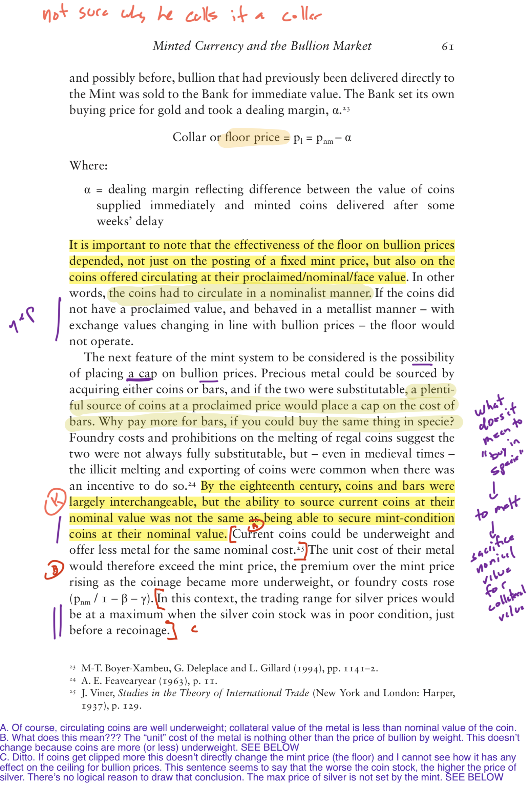

    

# The “Mark-UP” Assignment

### Background

The *point* of reading is to go on a journey with the author, to explore ideas, arguments, facts, and theories *with* (and sometimes *against*) the author. This means that if at the end of reading one has arrived at a “summary” or a series of bullet points, then one has absolutely failed to read properly, to read well. This is why Mortimer Adler argued, 85 years ago, for marking up a book: “reading, if it is active, is thinking, and thinking tends to express itself in words, spoken or written” (Adler 1941: 2). 

  

### Description

This is a very simple assignment: do what Adler suggests, and then provide evidence of having done so.

### Example

Here’s what that looks like:  
(taken randomly from the book I was reading when I put this assignment together).

  

### Details

-   A mark-up is just a copy of your marked-up readings for the week that you submit. 
-   I prefer that you scan your copy and upload it to the FileDrop folder, *prior to class.*
-   Following P&P principle, you can also give me your paper copy, *immediately after class.* I’ll return it the next week. 
-   For this course you must submit four (5) total mark-ups.
	-   2 are due before Exam 1
	-   2 are due between Exam 1 and Exam 2
	-   1 is due after Exam 2.
-   You may submit more than 5; your grade will not go over, but can be pushed closer to, 100%.